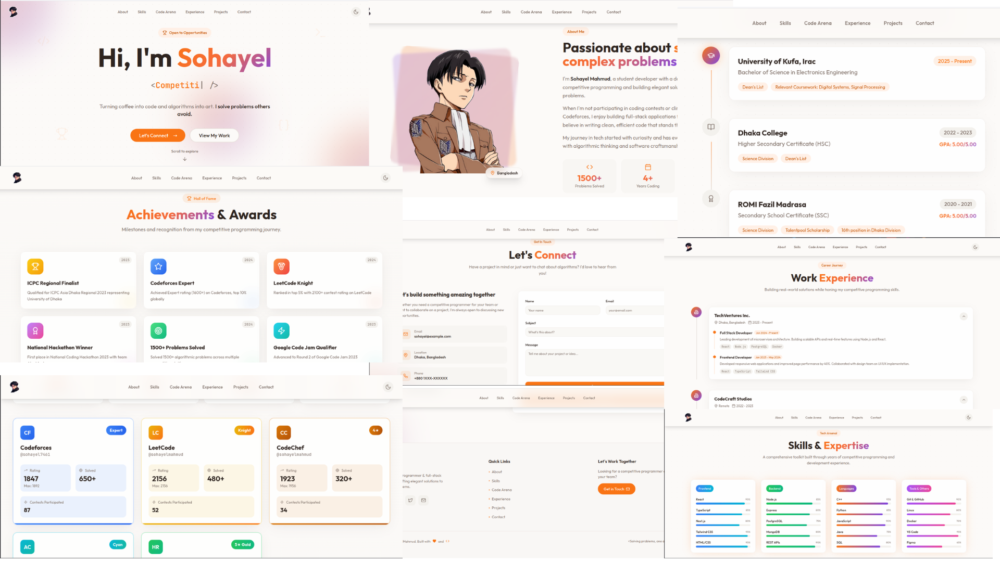
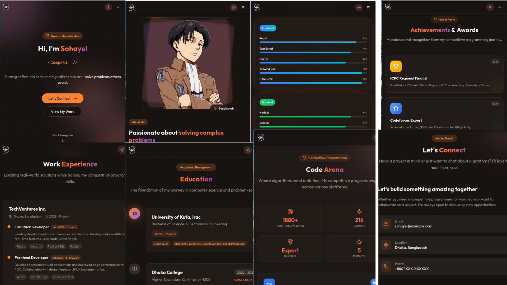

# Programmer Theme Portfolio Website


[](https://github.com/sohayelmahmud)
[](https://github.com/sohayelmahmud?tab=repositories)
[](https://github.com/sohayelmahmud/programmer-theme-portfolio/blob/main/LICENSE)


## Project info

A high-performance, SEO-optimized portfolio template for developers. Built with React 18, TypeScript, Vite, shadcn/ui, and Tailwind CSS. Features include a modern dark-themed UI, responsive layouts, and seamless animations with Framer Motion.

## Demo




## Live Demo

[Live Demo: https://programmer-theme-portfolio.vercel.app](https://programmer-theme-portfolio.vercel.app)

---

## Installing the project

To install **Programmer Theme Portfolio**, follow these steps:

Linux and macOS:

```bash
sudo git clone https://github.com/sohayelmahmud/programmer-theme-portfolio.git
```

Windows:

```bash
git clone https://github.com/sohayelmahmud/programmer-theme-portfolio.git
```

## How can I edit this code?

```bash
# install necessary dependencies
npm install

# Step 4: Start the development server with auto-reloading and an instant preview.
npm run dev

# To create an optimized production build, run:
npm run build
```

## What technologies are used for this project?

This project is built with:

- Vite
- TypeScript
- React
- shadcn-ui
- Tailwind CSS

---

##  Feedback

If you have any feedback or ideas to improve this project, feel free to contact me via

<a href="https://www.linkedin.com/in/sohayelmahmud/">
  

</a>
<a href="https://github.com/sohayelmahmud">
  
</a>
<a href="https://www.facebook.com/sohayel.mahmud.7/">
  
</a>